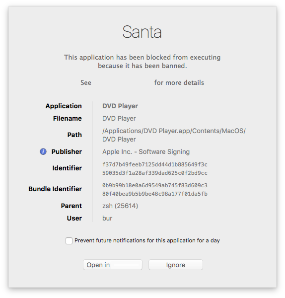

# Santa GUI

The Santa GUI process is pretty simple. It's only job is the display user GUI notifications. There are two types of notifications it can display.

There is a notification when an `execve()` is blocked.

When using FCM for push notifications, Santa GUI can display notifications when specific rules arrive.

