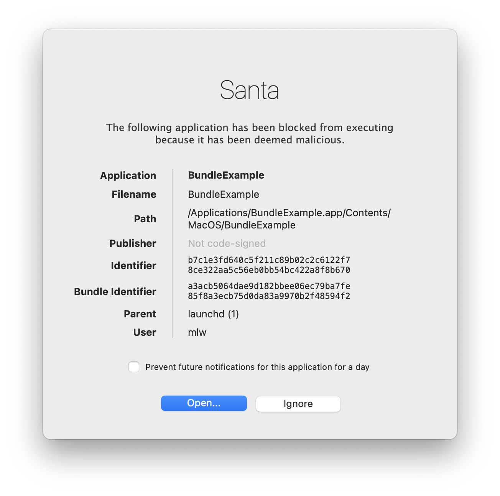
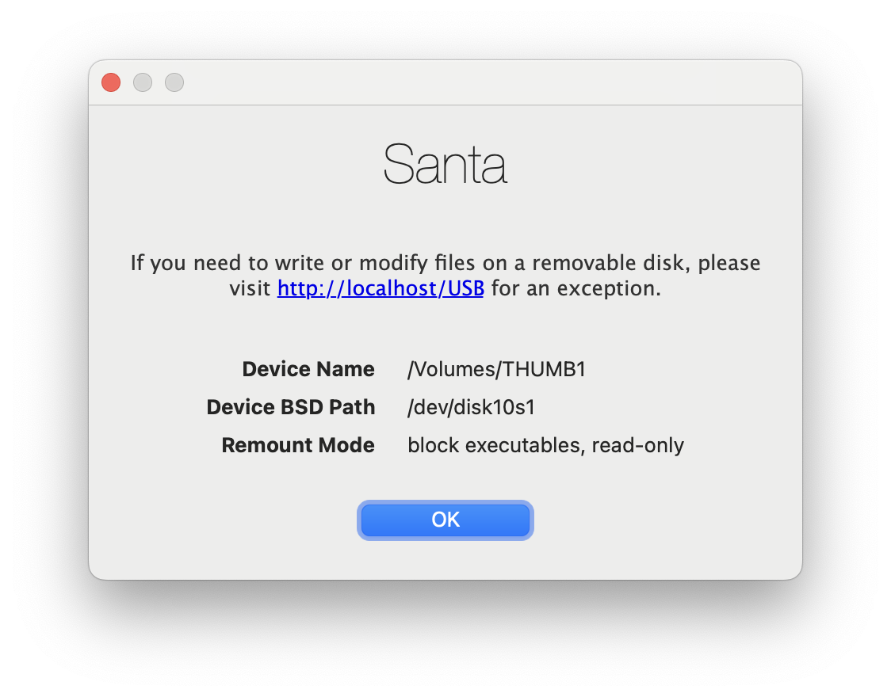
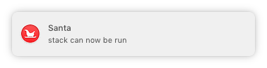

# Santa GUI

The Santa GUI displays user GUI notifications. The types of notifications it can display are:

- [Blocked Executions](#blocked-executions)
- [Blocked File Access](#blocked-file-access)
- [Blocked USB Mounting](#blocked-usb-mounting)
- [User Notifications](#user-notifications)

## Blocked Executions

When Santa prevents a binary from executing, it presents a dialog to the user
containing information about the binary that was denied. The message presented
to the user, the text of the **Open** button, and the destination URL for where
to send users when the **Open** button is clicked are all configurable on both a
global and per-rule basis.

If the rule was configured as `silent`, it will not display a dialog when Santa denies a binary from executing.

## Blocked File Access

[File Access Authorization](https://santa.dev/deployment/file-access-auth.html)
allows admins to configure Santa to monitor filesystem paths for potentially
unwanted access and optionally deny the operation. The message presented to the
user, and the text of the **Open** button, are configurable on both a global and
per-rule basis.

## Blocked USB Mounting

Santa can be configured to either prevent USB drives mounting, or force certain
options to be applied when mounting, such as mounting read-only.

## User Notifications

User notifications display for the following reasons:

*   The [client mode](https://santa.dev/concepts/mode.html) changes
*   Specific rules arrive when using FCM for push notifications

