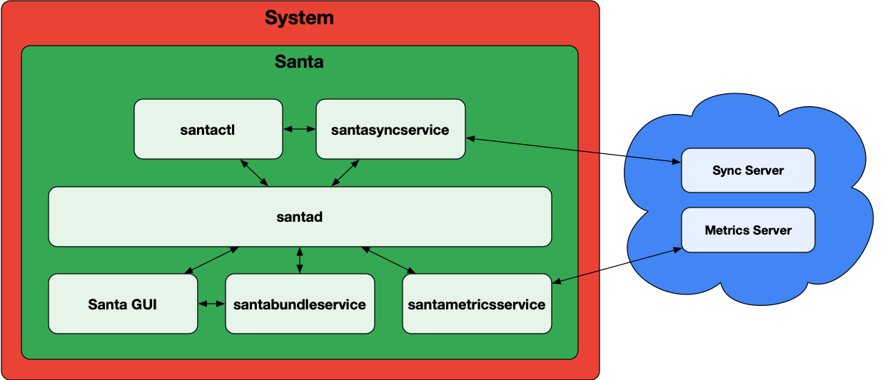

# Interprocess Communication (IPC)

Most IPC within Santa is done by way of Apple's
[XPC](https://developer.apple.com/documentation/xpc?language=objc). Santa wraps
[NSXPCConnection](https://developer.apple.com/documentation/foundation/nsxpcconnection?language=objc)
to provide client multiplexing, signature validation of connecting clients and
forced connection establishment. This is called MOLXPCConnection.

## Who starts who?

The primary Santa daemon, `santad` is a System Extension. It gets submitted as a
`launchd(8)` job by `endpointsecurityd(8)` via `sysextd(8)`. This happens at
system startup or when Santa is installed/upgraded.

The `Santa` GUI component runs as a launch agent when a user logs into the
system. There can be multiple Santa (GUI) processes running, one per user logged
into the GUI (assuming fast-user switching is enabled). While multiple processes
might be running, only the one for the user currently logged-in will be
connected to `santad` and receiving notifications.

`santasyncservice`, `santabundleservice` and `santametricservice` all run as
launch daemons. If a sync server is configured, `santasyncservice` gets launched
when `santad` starts up and establishes an XPC connection. The
`santabundleservice` starts up when a binary is blocked and the `Santa` GUI
establishes an XPC connection. Note, the `santabundleservice` also communicates
back with `santad`.

The `santametricservice` starts when the system comes up. `santad` opens and
maintains an XPC connection to the `santametricservice`.

`santactl` is a command-line utility that is executed at will by a user. It can
communicate with `santad` and the `santasyncservice` via XPC in order to issue
commands or collect information.

The `santabundleservice` process is started by `launchd` via a connection from the
Santa GUI. `santabundleservice` runs as root, which is necessary to ensure it
has permission to read all files.

| Process            | Parent Process | Running User |
| ------------------ | -------------- | ------------ |
| santad             | launchd        | root         |
| Santa (GUI)        | launchd        | user         |
| santactl           | varies         | user         |
| santasyncservice   | launchd        | nobody       |
| santametricservice | launchd        | nobody       |
| santabundleservice | launchd        | root         |

## Who communicates with who?

In short, `santad` has two-way communication with every other process. In
addition, `Santa` and `santabundleservice` have two-way communication between
each other. For other combinations, there is no direct communication.

## MOLXPCConnection and two-way communication

`MOLXPCConnection` enforces a server / client model for XPC connections. This
allows for strong signature validation and forced connection establishment. The
only problem with this model is the lack of two-way communication. For example,
process A can call methods on process B and retrieve a response, but process B
cannot call methods on process A.

To accomplish two-way communication, the following approach can be used:

1.  Process A creates a server with an anonymous `NSXPCListener`.
2.  Process A sends the anonymous `NSXPCListenerEndpoint` to process B over an
    already established `MOLXPCConnection`.
3.  Process B can now communicate directly with process A.

This is a powerful notion. It enables forced connection establishment between
both processes, which is critical when reliability is a concern.

