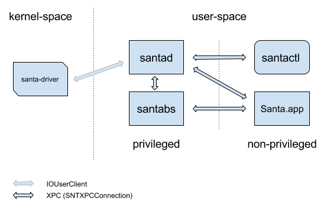

# Interprocess Communication (IPC)

Most IPC within Santa is done by way of Apple's
[XPC](https://developer.apple.com/documentation/xpc?language=objc). Santa wraps
[NSXPCConnection](https://developer.apple.com/documentation/foundation/nsxpcconnection?language=objc)
to provide client multiplexing, signature validation of connecting clients and
forced connection establishment. This is called SNTXPCConnection.

Communication between santad and santa-driver (KEXT) is done with a
[IOUserClient](https://developer.apple.com/documentation/kernel/iouserclient?language=objc)
subclass and IOKit/IOKitLib.h functions.

##### Who starts who?

The santad and Santa (GUI) processes are both started and kept alive by launchd
as a LaunchDaemon and a LaunchAgent, respectively. This means santad runs as
root and Santa (GUI) runs as the console user.

There can be multiple Santa (GUI) processes running, one per user logged into
the GUI (assuming fast-user switching is enabled). While multiple processes
might be running, only the one for the user currently logged-in will be
connected to santad and receiving notifications.

When using a sync server, the santactl process is started by santad. Before the
new process starts, all privileges are dropped. santactl runs as _nobody_.

The santabs process is started by launchd via an XPC service connection from
santad. XPC services inherit their initiator's privileges meaning santabs runs
as root, which is necessary to ensure it has permission to read all files.

Process  | Parent Process | Running User
-------- | -------------- | ------------
santad   | launchd        | root
Santa    | launchd        | user
santactl | santad         | nobody
santabs  | launchd        | root

##### Who communicates with who?

In short, santad has two-way communication with every other process. In
addition, Santa and santabs have two-way communication between each other. For
other combinations, there is no direct communication.

##### SNTXPCConnection and two way communication

`SNTXPCConnection` enforces a server / client model for XPC connections. This
allows for strong signature validation and forced connection establishment. The
only problem with this model is the lack of two-way communication. For example,
process A can call methods on process B and retrieve a response, but process B
cannot call methods on process A.

To accomplish two-way communication, the following approach can be used:

1.  Process A creates a server with an anonymous `NSXPCListener`.
2.  Process A sends the anonymous `NSXPCListenerEndpoint` to process B over an
    already established `SNTXPCConnection`.
3.  Process B can now communicate directly with process A.

This is a powerful notion. It enables forced connection establishment between
both processes, which is critical when reliability is a concern.
