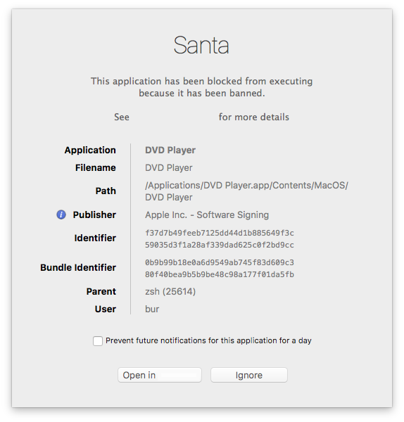

# Santa GUI

The Santa GUI process is pretty simple. It's only job is the display user GUI
notifications. There are two types of notifications it can display:

A notification when an `execve()` is blocked.

Notifications when specific rules arrive (when using FCM for push
notifications).

