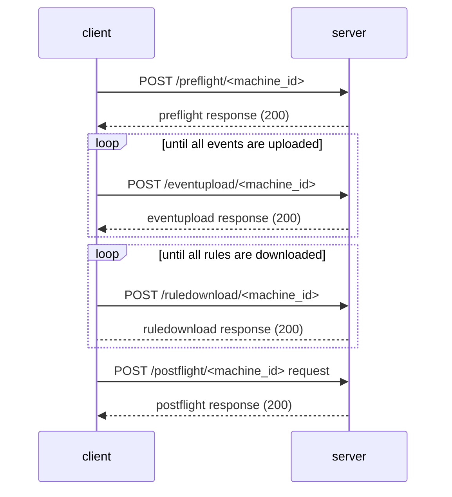
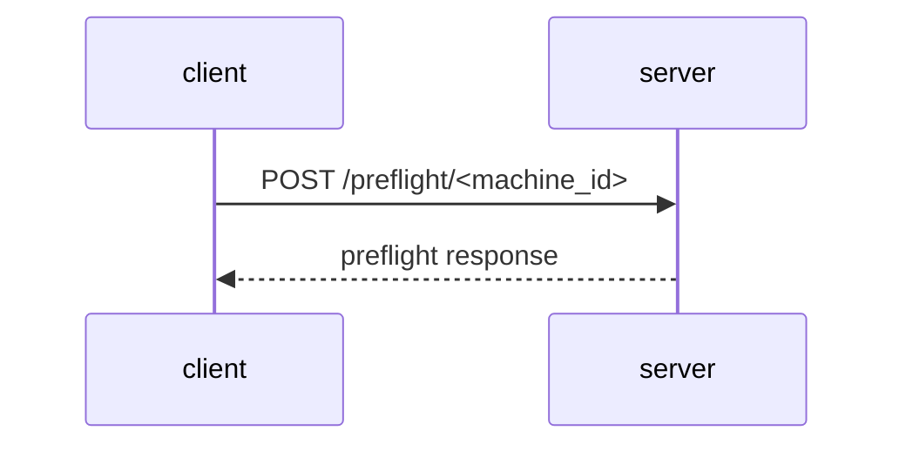
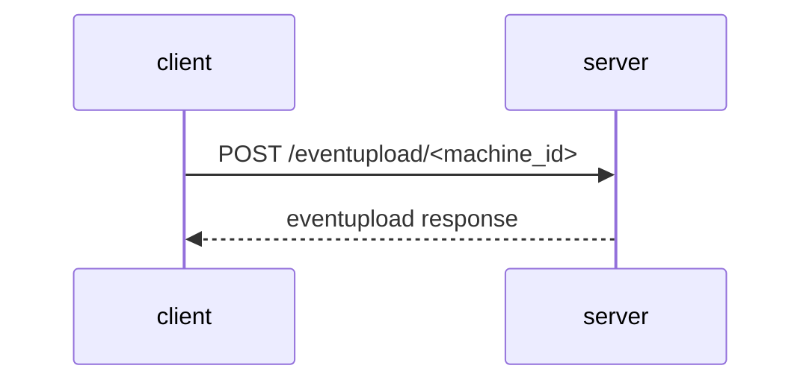
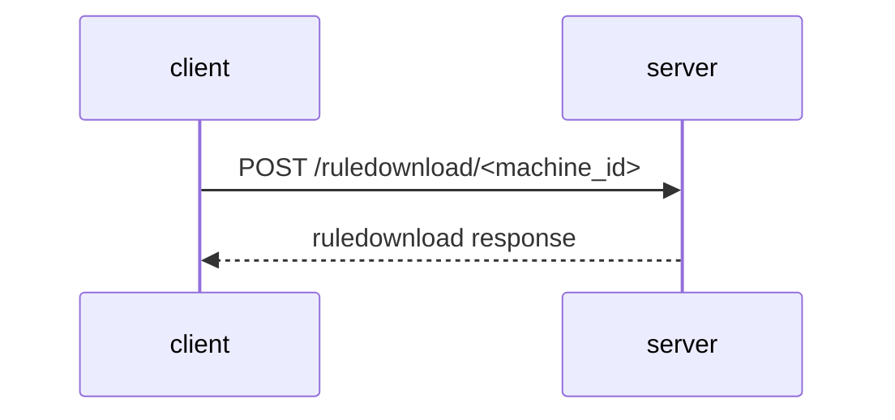
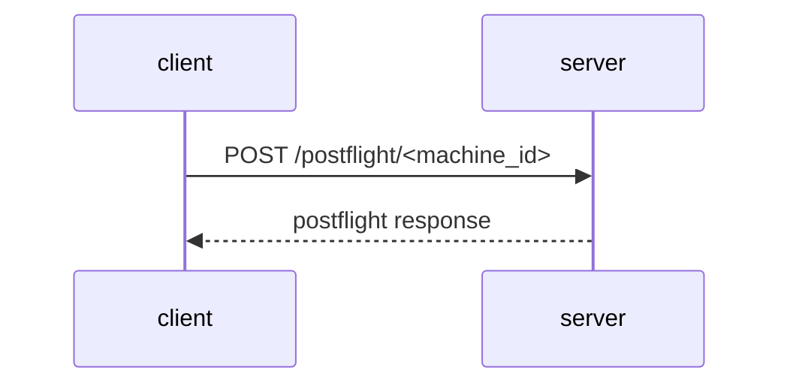

# Summary

This document describes the protocol between Santa and the sync server, also known as the sync protocol. Implementors should be able to use this to create their own sync servers.

## Background

Santa can be run and configured with a sync server. This allows an admin to
easily configure and sync rules across a fleet of macOS systems.  In addition to
distributing rules, using a sync server enables an admin to override some local
configuration options e.g. `LOCKDOWN` mode on both a fleet-wide and
per-host basis.

# Protocol Overview

The sync protocol is an HTTP/JSON based protocol. As such it is
assumed that both the server and client add `Content-Type` headers are set to
`application/json`.

The sync protocol is client initiated and consists of 4 request-response
transactions called stages, `preflight`, `eventupload`, `ruledownload`, and `postflight`.
A sync may consist of all 4 stages, just the `eventupload` stage or just the `ruledownload` stage.

| Stage | What it Does |
|---|---|
| **Preflight** | Report current Santa settings and machine attributes to sync server & retrieve configuration settings |
| **Event Upload** | Report new blockable events to the sync server |
| **Rule Download** | Retrieves new rules |
| **Postflight** | Reports stats |

If the server returns an HTTP status other than `200` for any stage than the sync stops and the next stage is not performed.

At a high level this looks like the following sequence:



Where `<machine_id>` is a unique string identifier for the client. By default
Santa uses the hardware UUID. It may also be set using the [MachineID, MachineIDPlist, and MachineIDKey options](../deployment/configuration.md) in the
configuration.

## Authentication

The protocol expects the client to authenticate the server via SSL/TLS. Additionally, a sync server may support client certificates and use mutual TLS.

## Stages

All URLs are of the form `/<stage_name>/<machine_id>`, e.g. the preflight URL is `/preflight/<machine_id>`.

### Preflight

The preflight stage is used by the client to report host information to the sync
server and to retrieve a limited set of configuration settings from the server.
These configuration options override the initial values set from the application
configuration profile.

This follows the following transaction:



#### `preflight` Request
The request consists of the following JSON keys:

| Key | Required | Type | Meaning | Example Value |
|---|---|---|---|---|
| serial_num    | YES | string | The macOS serial number from IOKit `kIOPlatformSerialNumberKey` |  "XXXZ30URLVDQ" |
| hostname      | YES | string | The FQDN hostname of the client | markowsky.example.com |
| os_version    | YES | string | The OS version of the client from /System/Library/CoreServices/SystemVersion.plist | 12.4 |
| os_build      | YES | string | The OS build from /System/Library/CoreServices/SystemVersion.plist | "21F5048e" |
| model_identifier | NO | string | The model of the macOS system  | |
| santa_version | YES | string | 2022.3 |
| primary_user  | YES | string | The username | markowsky |
| binary_rule_count | NO | int | Number of binary allow / deny rules the client has at time of sync| 1000 |
| certificate_rule_count | NO | int | Number of certificate allow / deny rules the client has at time of sync | 3400 |
| compiler_rule_count | NO | int | Number of compiler rules the client has time of sync |
| transitive_rule_count | NO | int | Number of transitive rules the client has at the time of sync |
| teamid_rule_count | NO | int | Number of TeamID rules the client has at the time of sync | 24 |
| client_mode | YES | string | the mode the client is operating in, either "LOCKDOWN" or "MONITOR" | LOCKDOWN |
| request_clean_sync | NO | bool | the client has requested a clean sync of its rules from the server. | true |


### Example preflight request JSON Payload:

```json
{
  "compiler_rule_count" : 14,
  "client_mode" : "MONITOR",
  "santa_version" : "2022.6",
  "serial_num" : "XXXZ30URLVDQ",
  "binary_rule_count" : 43676,
  "hostname" : "markowsky.example.com",
  "primary_user" : "markowsky",
  "certificate_rule_count" : 2364,
  "teamid_rule_count" : 0,
  "os_build" : "21F5048e",
  "transitive_rule_count" : 0,
  "os_version" : "12.4",
  "model_identifier" : "MacBookPro15,1",
  "request_clean_sync": true,
}
```

#### `preflight` Response

If all of the data is well formed, the server responds with an HTTP status code of 200 and provides a JSON response.

The JSON object has the following keys:

| Key | Required | Type | Meaning | Example Value |
|---|---|---|---|---|
| enable_bundles | NO | boolean | Enabled bundle scanning  | true |
| enable_transitive_rules | NO | boolean | Whether or not to enable transitive allowlisting | true |
| batch_size | YES | integer | Number of events to upload at a time | 128 |
| full_sync_interval | YES | integer | Number of seconds between full syncs | 600 |
| client_mode | YES | string | Operating mode to set for the client | either "MONITOR" or "LOCKDOWN" |
| allowed_path_regex | NO | string | Regular expression to allow a binary to execute from a path | "/Users/markowsk/foo/.*" |
| blocked_path_regex | NO | string | Regular expression to block a binary from executing by path | "/tmp/" |
| block_usb_mount | NO | boolean | Block USB mass storage devices | true |
| remount_usb_mode | NO | string | Force USB mass storage devices to be remounted with the following permissions (see [configuration](../deployment/configuration.md)) |  |
| clean_sync | YES | boolean | Whether or not the rules should be dropped and synced entirely from the server | true |

#### Example Preflight Response Payload

```json
{
 "batch_size": 100,
 "client_mode": "MONITOR",
 "allowed_path_regex": null,
 "blocked_path_regex": null,
 "clean_sync": false,
 "bundles_enabled": true,
 "enable_transitive_rules": false
}
```

### EventUpload

After the `preflight` stage has completed the client then initiates the
`eventupload` stage if it has any events to upload. If there aren't any events
this stage is skipped.

It consists of the following transaction, that may be repeated until all events are uploaded.



#### `eventupload` Request

| Key | Required | Type | Meaning | Example Value |
|---|---|---|---|---|
| events | YES | list of event objects | list of events to upload | see example payload |


##### Event Objects

:information_source: Events are explained in more depth in the [Events page](../concepts/events.md).

| Key | Required | Type | Meaning | Example Value |
|---|---|---|---|---|
| file_sha256 | YES | string | sha256 of the executable that was executed | "fc6679da622c3ff38933220b8e73c7322ecdc94b4570c50ecab0da311b292682" |
| file_path | YES | string | Absolute file path to the executable that was blocked | "/tmp/foo" |
| file_name | YES | string | Command portion of the path of the blocked executable | "foo" |
| executing_user | YES | string | Username that executed the binary | "markowsky" |
| execution_time | YES | float64 | Unix timestamp of when the execution occured | 23344234232 |
| loggedin_users | NO | List of strings | list of usernames logged in according to utmp | ["markowsky"] |
| current_sessions | YES | List of strings | list of user sessions | ["markowsky@console", "markowsky@ttys000"] |
| decision | YES | string | The decision Santa made for this binary, BUNDLE_BINARY is used to preemptively report binaries in a bundle. **Must be one of the examples**.| "ALLOW_BINARY", "ALLOW_CERTIFICATE", "ALLOW_SCOPE", "ALLOW_TEAMID", "ALLOW_UNKNOWN", "BLOCK_BINARY", "BLOCK_CERTIFICATE", "BLOCK_SCOPE", "BLOCK_TEAMID", "BLOCK_UNKNOWN", "BUNDLE_BINARY" |
| file_bundle_id | NO | string |  The executable's containing bundle's identifier as specified in the Info.plist | "com.apple.safari" |
| file_bundle_path | NO | string | The path that the bundle resids in | /Applications/Santa.app |
| file_bundle_executable_rel_path | NO | string | The relative path of the binary within the Bundle | "Contents/MacOS/AppName" |
| file_bundle_name | NO | string | The bundle's display name. | "Google Chrome" |
| file_bundle_version | NO | string | The bundle version string | "9999.1.1" |
| file_bundle_version_string | NO | string | Bundle short version string | "2.3.4" |
| file_bundle_hash | NO | string | SHA256 hash of all executables in the bundle | "7466e3687f540bcb7792c6d14d5a186667dbe18a85021857b42effe9f0370805" |
| file_bundle_hash_millis | NO | float64 | The time in milliseconds it took to find all of the binaries, hash and produce the bundle_hash | 1234775 |
| pid | YES | int | Process id of the executable that was blocked | 1234 |
| ppid | YES | int | Parent process id of the executable that was blocked | 456 |
| parent_name | YES | Parent process short command name of the executable that was blocked | "bar" |
| quarantine_data_url | NO | string |  The actual URL of the quarantined item from the quarantine database that this binary was downloaded from | https://dl.google.com/chrome/mac/stable/GGRO/googlechrome.dmg |
| quarantine_referer_url | NO | string | Referring URL that lead to the binary being downloaded if known.  | https://www.google.com/chrome/downloads/ |
| quarantine_timestamp | NO | float64 | Unix Timestamp of when the binary was downloaded or 0 if not quarantined | 0 |
| quarantine_agent_bundle_id | NO | string | The bundle ID of the software that quarantined the binary | "com.apple.Safari" |
| signing_chain | NO | list of signing chain objects | Certs used to code sign the executable | See next section |

##### Signing Chain Objects

| Key | Required | Type | Meaning | Example Value |
|---|---|---|---|---|
| sha256 | YES | string | sha256 of the certificate used to sign | "7ae80b9ab38af0c63a9a81765f434d9a7cd8f720eb6037ef303de39d779bc258" |
| cn | YES | string | Common Name field of the certificate used to sign | "Apple Worldwide Developer Relations Certification Authority" |
| org | YES | string | Org field of the certificate used to sign | "Google LLC" |
| ou | YES | string | OU field of the certificate used to sign | "G3" |
| valid_from | YES | int | Unix timestamp of when the cert was issued |  1647447514 |
| valid_until | YES | int | Unix timestamp of when the cert expires |  1678983513 |


##### `eventupload` Request Example Payload

```json
{
  "events": [{
    "file_path": "\/Applications\/Santa.app\/Contents\/MacOS",
    "file_bundle_version": "9999.1.1",
    "parent_name": "launchd",
    "logged_in_users": [
      "markowsky"
    ],
    "quarantine_timestamp": 0,
    "signing_chain": [{
        "cn": "Apple Development: Google Development (XXXXXXXXXX)",
        "valid_until": 1678983513,
        "org": "Google LLC",
        "valid_from": 1647447514,
        "ou": "XXXXXXXXXX",
        "sha256": "7ae80b9ab38af0c63a9a81765f434d9a7cd8f720eb6037ef303de39d779bc258"
      },
      {
        "cn": "Apple Worldwide Developer Relations Certification Authority",
        "valid_until": 1897776000,
        "org": "Apple Inc.",
        "valid_from": 1582136027,
        "ou": "G3",
        "sha256": "dcf21878c77f4198e4b4614f03d696d89c66c66008d4244e1b99161aac91601f"
      },
      {
        "cn": "Apple Root CA",
        "valid_until": 2054670036,
        "org": "Apple Inc.",
        "valid_from": 1146001236,
        "ou": "Apple Certification Authority",
        "sha256": "b0b1730ecbc7ff4505142c49f1295e6eda6bcaed7e2c68c5be91b5a11001f024"
      }
    ],
    "file_bundle_name": "santasyncservice",
    "executing_user": "root",
    "ppid": 1,
    "file_bundle_path": "/Applications/Santa.app",
    "file_name": "santasyncservice",
    "execution_time": 1657764366.475035,
    "file_sha256": "8621d92262aef379d3cfe9e099f287be5b996a281995b5cc64932f7d62f3dc85",
    "decision": "ALLOW_BINARY",
    "file_bundle_id": "com.google.santa.syncservice",
    "file_bundle_version_string": "9999.1.1",
    "pid": 2595,
    "current_sessions": [
      "markowsky@console",
      "markowsky@ttys000",
      "markowsky@ttys001",
      "markowsky@ttys003"
    ],
    "team_id": "XXXXXXXXXX"
  }]
}
```

#### `eventupload` Response

The server should reply with an HTTP 200 if the request was successfully received and processed.


| Key | Required | Type | Meaning | Example Value |
|---|---|---|---|---|
| event_upload_bundle_binaries | NO | list of strings | An array of bundle hashes that the sync server needs to be uploaded | ["8621d92262aef379d3cfe9e099f287be5b996a281995b5cc64932f7d62f3dc85"] |

##### `eventupload` Response Example Payload


```json
{
   "event_upload_bundle_binaries": ["8621d92262aef379d3cfe9e099f287be5b996a281995b5cc64932f7d62f3dc85"]
}
```

### Rule Download

After events have been uploaded to the sync server, the `ruledownload` stage begins in a full sync.

Like the previous stages this is a simple HTTP request response cycle like so:



If either the client or server requested a clean sync in the `preflight` stage, the client is expected to purge its existing rules and download new rules from the sync server.

If a clean sync was not requested by either the client or the sync service, then the sync service should only send new rules seen since the last time the client synced.

Santa applies rules idempotently and is designed to receive rules multiple times without issue.

#### `ruledownload` Request

 This stage is initiated via an HTTP POST request to the URL `/ruledownload/<machine_id>`

| Key | Required | Type | Meaning |
|---|---|---|---|
| cursor | NO | string | a field used by the sync server to indicate where the next batch of rules should start |


##### `ruledownload` Request Example Payload

On the first request the payload is an empty dictionary

```json
{}
```

In the `ruledownload` response a special field called `cursor` will exist if there are more rules to download from server. The value and form of this field is left to the sync server implementor. It is expected to be used to track where the next batch of rules should start.

On subsequent requests to the server the `cursor` field is sent with the value from the previous response e.g.

```json
{"cursor":"CpgBChcKCnVwZGF0ZWRfZHQSCQjh94a58uLlAhJ5ahVzfmdvb2dsZS5jb206YXBwbm90aHJyYAsSCUJsb2NrYWJsZSJAMTczOThkYWQzZDAxZGRmYzllMmEwYjBiMWQxYzQyMjY1OWM2ZjA3YmU1MmY3ZjQ1OTVmNDNlZjRhZWI5MGI4YQwLEgRSdWxlGICA8MvA0tIJDBgAIAA="}
```

#### `ruledownload` Response

When a `ruledownload` request is received, the sync server responds with a JSON object
containing a list of rule objects and a cursor so the client can resume
downloading if the rules need to be downloaded in multiple batches.

| Key | Required | Type | Meaning |
|---|---|---|---|
| cursor | NO | string | Used to continue a rule download in a future request |
| rules | YES | list of Rule objects | List of rule objects (see next section). |

##### Rules Objects


| Key | Required | Type | Meaning | Example Value |
|---|---|---|---|---|
| identifier | YES | string | The attribute of the binary the rule should match on e.g. the team ID of a binary or sha256 hash value | "ff2a7daa4c25cbd5b057e4471c6a22aba7d154dadfb5cce139c37cf795f41c9c" |
| policy | YES | string | Identifies the action to perform in response to the rule matching. Must be one of the examples | "ALLOWLIST","ALLOWLIST_COMPILER", "BLOCKLIST", "REMOVE",  "SILENT_BLOCKLIST" |
| rule_type | YES | string | Identifies the type of rule. Must be one of the examples | "BINARY", "CERTIFICATE", "SIGNINGID", "TEAMID" |
| custom_msg | NO | string | A custom message to display when the rule matches | "Hello" |
| creation_time | NO | float64 | Time the rule was created | 1573543803.349378 |
| file_bundle_binary_count | NO | integer | The number of binaries in a bundle | 13 |
| file_bundle_hash | NO | string | The SHA256 of all binaries in a bundle | "7466e3687f540bcb7792c6d14d5a186667dbe18a85021857b42effe9f0370805" |


##### Example `ruledownload` Response Payload

```json
{
  "rules": [{
    "identifier": "ff2a7daa4c25cbd5b057e4471c6a22aba7d154dadfb5cce139c37cf795f41c9c",
    "rule_type": "CERTIFICATE",
    "policy": "BLOCKLIST",
    "custom_msg": "",
    "creation_time": 1573543803.349378
  }, {
    "identifier": "233e741538e1cdf4835b3f2662e372cf0c2694b7e20b4e4663559c7fb0a9f234",
    "rule_type": "BINARY",
    "policy": "ALLOWLIST",
    "custom_msg": "",
    "creation_time": 1573572118.380034,
    "file_bundle_binary_count": 13,
    "file_bundle_hash": "7466e3687f540bcb7792c6d14d5a186667dbe18a85021857b42effe9f0370805"
  },
  {
    "identifier": "EQHXZ8M8AV",
    "rule_type": "TEAMID",
    "policy": "ALLOWLIST",
    "custom_msg": "Allow Software Google's Team ID",
    "creation_time": 1576623399.151607,
    "file_bundle_binary_count": 7,
    "file_bundle_hash": "e4736dd3a731f5f71850984175c0ec54dcde06021af18f476eb480c707fbecda"
  }],
  "cursor": "XXXXXXXXXXXXXXXXXXXXXXXXXXXXXXXXXXXXXXXXXXXzfmdvb2dsZS5jb206YXBwbm90aHJyYAsSCUJsb2NrYWJsZSJANGYyYTA2MjY1ZjRiODQ2M2Y2YjI0MmNiZTMwMTNkMGZhNjlkNDUxNmI4OTU3Y2I3ZDAxZDcyMTJkM2NhZmZiNAwLEgRSdWxlGICA8Kehk9MKDBgAIAA="
}
```

### Postflight

The postflight stage is used for the client to inform the sync server that it has successfully finished syncing. After sending the request, the client is expected to update its internal state applying any configuration changes sent by the sync server during the preflight step.

This stage uses an HTTP POST request to the url `/postflight/<machine_id>`



#### `postflight` Request

The request is empty and should not be parsed by the sync server.

#### `postflight` Response

The server should reply with an HTTP 200 if the request was successfully received and processed. Any message body is ignored by the client.

<div id="mermaidjs-code" style="visibility: hidden">
<script src="https://unpkg.com/mermaid@9.1.3/dist/mermaid.min.js"></script>
<script>
   document.addEventListener("DOMContentLoaded", function(event) {
    mermaid.initialize({
      startOnLoad:true,
      theme: "forest",
    });
    window.mermaid.init(undefined, document.querySelectorAll('.language-mermaid'));
});
</script>
</div>
